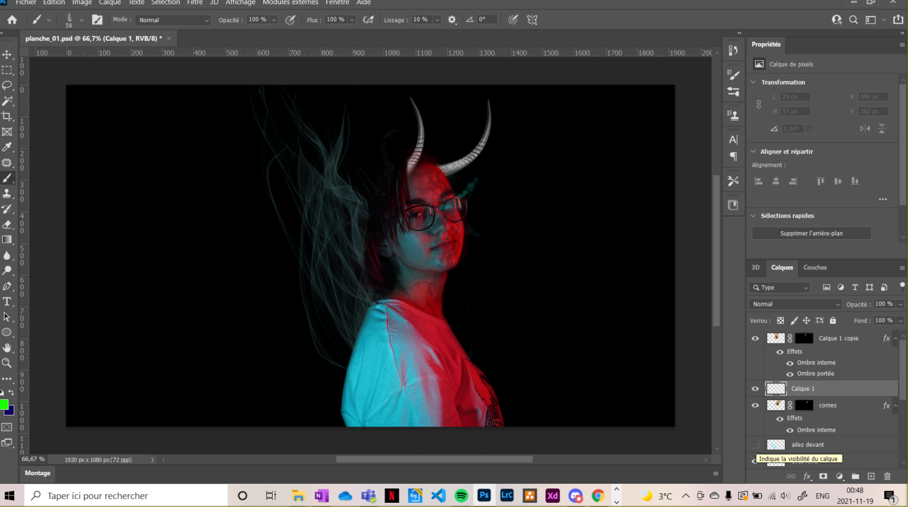

# Faire des ailes enflammé sur photoshop

Le pinceau est un des outils les plus utilisés sur photoshop. On peux littéralement faire de tout grâce à cet outil. Voici un tutoiel sur comment faire les ailes ci-dessous.

# La marche à suivre
1. Rechercher sur internet «fire brush photoshop». La brosse devrait favorablement être triangulaire pour avoir les pointes des ailes plus petites que la base. Trouvez la brosse, puis l'enregistrer et l'ouvrir dans photoshop.

2. Pour y accèder, il faut descendre dans l'icone de pinceau, jusqu'en bas de la liste et choisir la couleur des ailes. 

3. Pour que ça parrait plus réaliste, baisser l'opacité pour les ailes du fond, vue qu'elles sont derrière.

4. Pour que l'aile soit dans la direction desiré, il faut faire une rotation du pinceau grâce à cet icone.

5. Pour les ailes de devant, juste augmenter l'opacité du pinceau, et refaire les mêmes étapes, et voilà!

